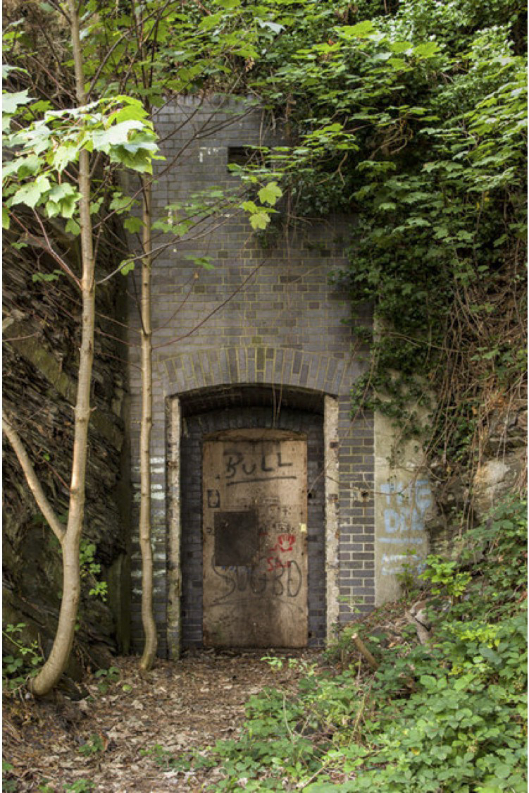

## We take the golden road to Aberystwyth
_Andrew Prescott_

It is a windy, cold, breezy February Sunday on the west  coast of Wales, about ten miles south of Aberystwyth. I am awaiting the arrival of the next winter storm, Imogen, and wondering if it will disrupt my journey to London. My friends Jon and Irini and the lovely people from UnBox have asked me to write something about caravans and silk routes. It all seems a long way away and impossibly remote.

My scholarly interests are, I apologetically admit, focused on Britain. I adore exploring the libraries, archives and museums of Britain, and part of my enthusiasm for digitisation is because it gives new ways of exploring and enjoying those archives. For me, the exploration in late middle age of fresh archival and bibliographical vistas in Wales, Scotland and other parts of Britain have been as fascinating an excursion as I could imagine. As I get older, all I want to do is to burrow more deeply into those archives and to try pulling together the things I have found.

But I am writing here in the land celebrated by George Borrow as ‘Wild Wales’. Borrow’s writings on the Romani people helped popularise the romantic image of the caravan and fostered the early twentieth century enthusiasm for the
idea that caravans might take us back to a simpler, purer way of life. I don’t know what Borrow would make of the luxury caravans that rush through our village in the summer or the mobile home parks that are dotted along the coast. I don’t think he imagined that they might be his most distinctive legacy to Wales.

As a teenager I was a great enthusiast for the music of Frederick Delius, to which I was introduced by Ken Russell’s marvellous film, Song of Summer (1968). Delius wrote the incidental music for a tragic play by the poet James Elroy Flecker called Hassan, which is one of the most lyrical expressions of that phenomenon defined by Edward Said as ‘Orientalism’ —a patronising and infantalising Western view of Eastern cultures. Flecker’s play concludes with a chorus as two main characters, disillusioned with the capriciousness and cruelty of court life in Baghdad, decide to join a caravan train on the Golden Road to Samarkand.

_We easily underestimate the importance of these older forms of connectivity—the Romani caravans that crisscrossed Europe in the fifteenth century, the camels and caravans that connected east and west across the silk roads. It is easy to imagine both east and west as impossibly isolated until modern forms of communication such as the telegraph, railroad and Internet intervened. At an early time, the caravan connected remote areas like Afghanistan to the ports of Europe, and the sea connected places like Wales and Ireland to the wider world._

  _Entrance to the ‘cave’ at Grogythan, Aberystwyth, beneath the National Library of Wales_

Manuscripts from Wales and Ireland show us how the caravan brought light and colour to the west from these countries at the earliest time. The deepest blue used for colouring in the Middle Ages was prepared for the precious stone lapis lazuli, mined in Afghanistan and brought by camel and caravan to Europe. The colour was known as ultramarine, because it came from beyond the sea. Michelle Brown has pointed out that colouring from lapis lazuli can  be found in tenth-century illuminations added in England to an Irish pocket [gospel book](http://britishlibrary.typepad.co.uk/digitisedmanuscripts/2013/12/the-irish-pocket-gospel-book.html), preserved in the British Library. The deep blue in illuminated manuscripts preserved in the National Library of Wales is also derived from lapis lazuli brought by caravan from the east.

But the connections between Aberystwyth and the Silk  Road run deeper still. Dunhuang, a frontier town on the edge of the Gobi desert in northwest China, was a major stop on the Silk Road. Close to Dunhuang are hundreds of Buddhist caves. In 1900, it was found that one of the caves contained  a huge Buddhist library, which had been sealed up in the cave at the end of first millennium CE. In a series of expeditions, thousands of ancient manuscripts were retrieved from
this cave, and taken to libraries in London, France, Russia, Germany, Japan, Korea and China. In London, the material taken from Dunhuang by Sir Aurel Stein contains some of the British Library’s most famous Chinese treasures. The huge International [Dunhuang Project](idp.bl.uk), a remarkable collaborative international digitisation project, is using digital imaging to reassemble and reintegrate the material from Dunhuang. Among the items found by Stein at Dunhuang is the [Diamond Sutra](en.wikipedia.org/wiki/Diamond_Sutra), the oldest dated printed book in the world, over 1300 years old.
During the First World War, there was a threat of air raids on the British Museum building, and the decision was taken to move some materials to the National Library of Wales
in Aberystwyth, including the material Stein had sent  from Dunhuang. In 1918, Stein was writing a book about  his discoveries in his retreat on the Kashmiri alpine hillside of Mohand Marg. He received a letter from Lionel Barnett, the Keeper of Oriental Manuscripts and Printed Books at the British Museum, who reported the safe arrival of these Silk Road treasures in Aberystwyth, and described how:
>In one respect I am (for the time being) like you: I am on the top of a hill. The National Library of Wales has been built  with fine judgment on the summit of the hills which surround Aberystwyth in a semicircle, so that we have on the one side the sea in all its glory and on the other the everlasting hills, green and purple.[1](#fn1)<a id="fnref1"/>

Thus, for a time the world’s oldest dated printed book came from Dunhuang to Aberystwyth. It was to return again, for during the Second World War, many of the British Museum’s greatest treasures were stored in specially constructed air-conditioned caves beneath the National Library of Wales[2](#fn2)<a id="fnref2"/>. The entrance to the caves can still be seen on the hillside beneath the library. Joyce Morgan has described how the Stein collection came to Aberystwyth in the Second World War in this fascinating article on [‘The Stein Collection and World War II”](britishmuseum.org/pdf/14_Morgan%20REV.pdf).

Connectivity runs deep, adopts surprising shapes and links disparate points, as the story of the Silk Road, the oldest printing and Aberystwyth makes clear. I hope the UnBox caravan makes similar links and forges new connectivities.

<ol>

<li id="fn1"><a href="britishmuseum.org/pdf/14-Morgan%20pp.pdf">britishmuseum.org/pdf/14-Morgan%20pp.pdf</a> <a href="#fnref1">↩</a></li>
<li id="fn2"><a href="news.bbc.co.uk/2/hi/uk_news/wales/mid_/7820055.stm">news.bbc.co.uk/2/hi/uk_news/wales/mid_/7820055.stm</a> <a href="#fnref2">↩</a></li>
</ol>