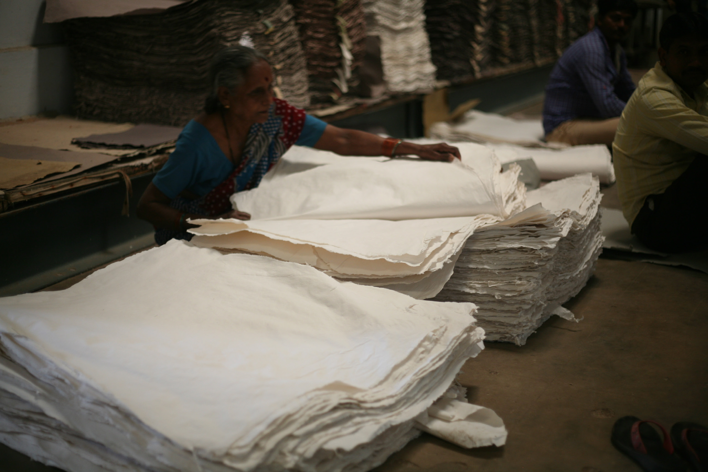

## An epic meeting of two worlds
_Michelle Thorne_

In the tech world, the ‘hackathon’ is king. It’s an event format where you invite a group of people together and make things for a brief period of time. The events typically run for a weekend, and there can be a lot of pressure on participants to produce as much as possible in that time.

When making technology, or anything really, the speed at which you go about it can influence what you make and how you do it.

_Are your ideas quick and throwaway? Do you have time to consider the place and materials required for what you’re making? Where do they come from, where are they going, and who will interact with and be affected by them? Do you have time to know who you’re building for, and are their voices with you in the room?_

These questions are often not fully explored at hackathons. There’s just not enough time. But they are important questions. The UnBox Caravan asks them. One of the main reasons it seems able to do that is because it grants itself the time.

UnBox Caravan is a slow convening. Slow down and have a chai. Slow down and cook a meal with your neighbours. Slow down and observe where you are so that you can make something with intention.

We had time to visit and understand local manufacturing processes. This in turn inspired us to make things using local materials, traditional crafts and Indian electronics. We had time to travel by train, slowing our pace and opening up hours to discuss project ideas and converse. We had time to meet and socialize with our neighbours in the Old Town, where we stayed. These exchanges enabled us to ask deeper questions about their home, their relationships with technology and how they would or wouldn’t like to connect.

Many events can treat their location as a neutral backdrop. You’re shuttled from an air-conditioned hotel to a generic convention center. There’s no time to understand why you’re in a certain place and who lives there. There’s no time to engage with your surroundings, to be inspired by it and ideally contribute back to it.

Inspired by the UnBox Caravan, and finding parallels with the Slow Movement, I propose that a slow convening:

* Provides ample time in the agenda to observe, listen and reflect.
* Facilitates homestays or accommodation that celebrate the architecture and domestic heritage of a place.
* Incorporates local cuisine and ingredients as a path to understanding cultural practices and sustainable eating.
* Sources event materials from local manufacturers and explores the affordances of a place’s crafts and skills.
* Seeks event venues that are active partners in the agenda and bridge the event into local communities.
* Fosters understanding and sensitivity to local languages.
* Strives to contribute something positive and sustainable in the place where the event takes place. These are small observations from a two-week convening. There is an acknowledged luxury in that length of time.

Nevertheless, I believe it is not a contradiction to take a slow convening approach to shorter events. We’ve explored that, for example, during a five-day retreat in Anstruther, Scotland, and we hope to do more of it in 2016 as the Caravan continues.