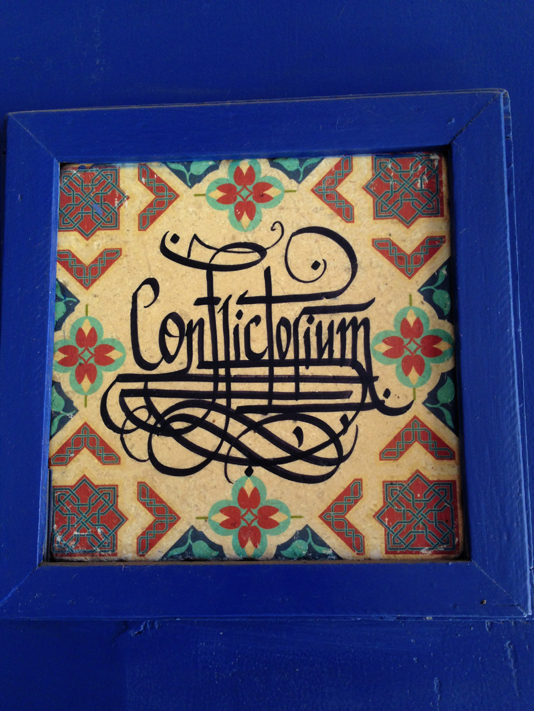
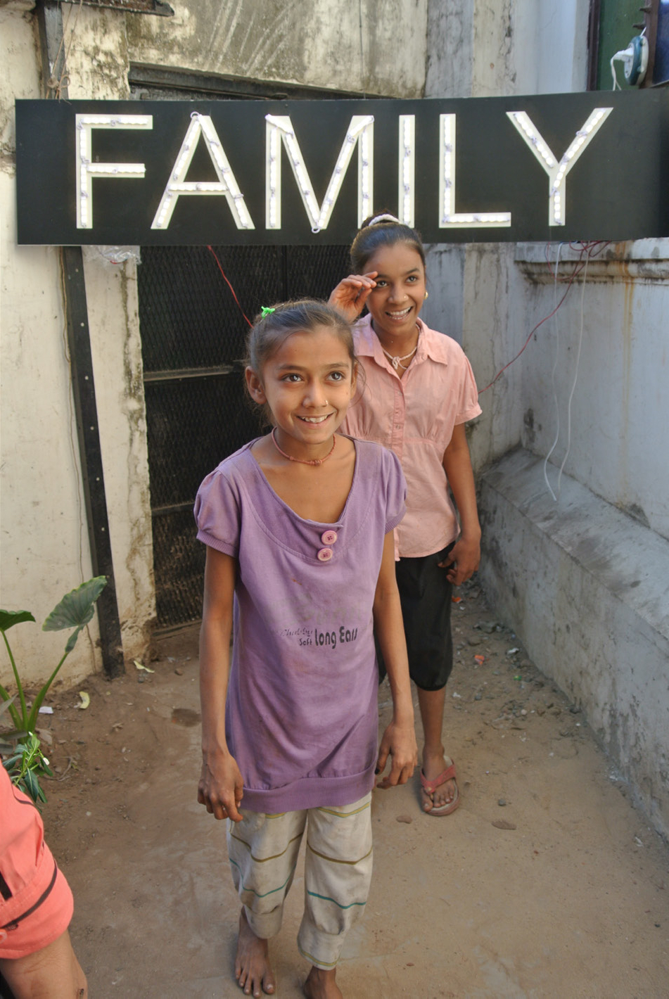

## Fragments of (dis)connection
_Annette Mees_

**Disconnection**.
Day two. I race around town with three students from the NID. We visit woodworkers making home altars, Manek Chowk – a market for metals; gold, silver, brass, bronze, steel. I’m still shy about communicating without words.  The NID students translate – they are amazing. I feel like an observer.  The students dress me in a sari. They love me in it, I love me in it, so I buy it. Now, nine days later, I still don’t know how to tie it. I wonder if I will ever get to wear it.

The UnBox Caravan connects via Slack and Whatsapp. Messages from back home come through on those platforms too. Fragments of the rest of the world; a question about Kintsugi (Japanese gold ceramic repair), a discussion about the use of Artificial Intelligence in gallery spaces, a picture from fellow WIRED fellow posing with Bob Geldof and Kofi Anan for Vanity Fair. Facebook says I have five events this weekend. It all feels impossibly far away.

**Connection**
Pete and I decide to visit the Conflictorium, a museum about conflict and peace. It is a wonderful place mixing art with politics, pop culture with high art and design, interactive installations exploring possible transformations. It is an open space, aspirational, housed in the middle of Mirzapur, the old part of Ahmedabad. I feel home. We meet Shefali. She holds a degree in conflict resolution and has worked in the museum since it opened. We talk about the vision of the museum,
its openness, the communities around the museum, their problems with casual violence and alcoholism. She tells  us about the project where they made comic books about
experiences of violence with local women, and peer-learning workshops currently running with 10-15 yr olds. I feel at home.  She invites us to come meet the kids at the workshop the next day.

Pete and I adopt the Conflictorium together. We both love  it, for the same reasons and for different reasons. It’s great going on an adventure with a curator. We are at the kids workshop. They are unfathomably excited to have such odd guests. We take off our shoes to join in. We can’t join in. We don’t know the lyrics to the song. Rachida (age 12) next to me helpfully holds up the text in Guajarati. I pretend to read along. Then we play.

I teach them Zip Zap Boing – a theatre warm up game. They teach us a game called Balu (or Bear). One person is a ’bear’ everyone else freezes. The bear prowls and growls until someone laughs or moves. Then they too become a bear. This continues till there is only one person still frozen. They win. Pete makes a great bear.

**Disconnection**
We come back to the Museum of Conflict to another workshop with our group of children. This time we give them two of the disposable cameras Sara brought with  her. We split into two groups. We ask them to go out in   the neighbourhood and take pictures of things that excited them and things that made them sad. They were mostly excited about taking pictures of themselves. I go out with one group. My presence however proves distracting. A
Westerner attracts an audience. I shake hands, say hello and generally move with a crowd. It reminds me of theatrical flocking games and Greek choruses; we move as one. It gets in the way of the kids taking photographs. Someone gently suggests it might be better if I go back to the Museum. I retreat.
I meet Atish of Budhan Theatre with Shena from the Conflictorium, and Pete. Atish tells us stories of his tribe the Chhara, a nomadic tribe. They were entertainers, performers. The British declared them “born criminals”. They were
known as thieves. They don’t have access to mainstream education, employment, and they get moved around to live in terrible places-- their neighbourhoods are literally not on the map. The Chhara are one of many ‘Denotified Tribes’ in India. The stories are heart breaking. Walking through the neighbourhood I feel out of place.

**Connection**
I wander around on my own for a bit. I hear the sound first. To my western ear it sounds like a kazoo. It is not a kazoo but it shares its properties; a small whistle designed to sound silly. I find a small puppet theatre, and it’s beautiful. A drummer/storyteller on one side of the stage and an array of puppets with delicately carved grotesque faces with long lean limbs covered in colourful traditional Indian garments. One hidden puppeteer with his kazoo-like whistle accompanies the action. It feels like magic. My fellow audience members are five small children and their parents. It is abundantly clear both to the children and their parents in what category I fall.

I’m quickly invited to sit in the front next to a four-year-old girl. Together we howl with the delight when one of the puppets starts a macabre dance juggling its own head. The not-kazoo creates a perfect slapstick score.

I meet Amitesh, an artist who lives and works in Delhi. We explain our practices to each other. He has come from traditional theatre but moved into installation. I was trained at the Royal Academy of the Arts in my native country, The Netherlands but moved into experimental interactive theatre. Our practices sit somewhere between performance, art installation and experiences. We reference the same books, artists, practices and theories.  Then we discover Amitesh worked with a British producer I know. He has played a game I designed years ago with an English colleague and a Chinese artist I didn’t know.  It seems right that we have already played together without knowing.

**Disconnection**
I need to send a draft to a collaborator – an answer to the question: what would it look like if your current artistic project would be transformed into a festival? I’ve been putting it off - the ideas are not coming together – my imagination is currently saturated with experiences and imagery from here. I send an email with thoughts, explaining it is hard to connect thoroughly with the brief, that my brain is submerged in Ahmedabad. I apologize for doing such a bad job.

Pete and I do a photography project at the Conflictorium. We attempt to create family portraits of ‘Families of the Future’. Mustaq, who works at the museum, writes the instructions in Gujarati. The kids just want to pose. Being on camera is what is exciting. Our carefully laid plans are swallowed up in the beautiful chaos created by the enthusiasm of the kids. One girl asks, “what does that word mean?” as she points
at “future”. Pete makes beautiful pictures of all of them at play.

**Connection**
In the chaos of the ‘Future Photography Studio’ we find moments to interview some children about their ideas about the future. Mustaq, who works at the museum, asks them questions, I record. I can’t understand what they are saying. I read their faces -- the moments when they ponder what might be possible, the shiny eyes when they describe possible and impossible dreams, the shyness about some others and the mischief that belies others. I love these moments.

I meet Archana, an artist from Bangalore. She makes UFOs: cultural spaces Under Fly Overs. We talk about our practice, how we both are excited about art as a place to connect different stakeholders; artists, technologists, public bodies, private companies, academics. I’m surprised by how closely both our methodologies and dreams are aligned. I interview her about the future. She speaks beautifully about the alignment of the roles of mother, artist and entrepreneur and the dream to see a future where people don’t have to feel divided between the past and the future. I recognize myself in everything she says.

At the end of our visit to Chhara’s Budhan Theatre, Atish and I talk about interactive theatre, Boal, audience engagement techniques, and the use of sound and music in storytelling. We talk about our shared aesthetic of breaking down boundaries between actors and audiences –about tactics we both use. Our context is completely different but our craft overlaps. We are both artists and theatre makers- we are peers. Later today I’m attending rehearsals.