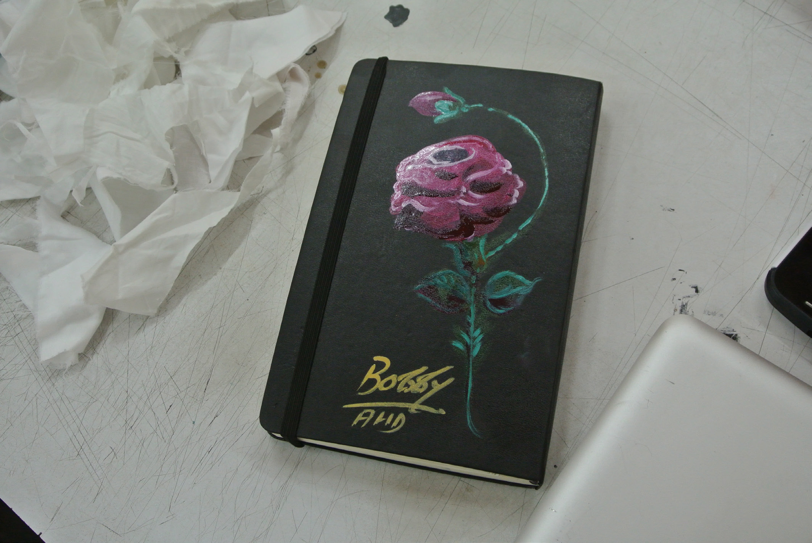

## Post lab reflection
_Akshay Roongta_

**Day T minus 2**

Coming in to Ahmedabad, I had serious reservations about what I was going to be able to contribute to the Caravan. What I was feeling was impostor syndrome (I’d heard about it at some point). A half hour of Googling and skim reading  a few articles and I knew that this was it. This was before  I’d read the profiles of the other fellows; once I’d read those, the big questions for me were, ‘What the hell am I going to contribute?’ and ‘What fictitious family emergency was suddenly going to pull me away?’I guess the reservations sprang from the sense that I hadn’t really built or done anything substantial, and more importantly most of what I had done was far too grounded in issues that surround us today, in a context that felt far removed from the one the caravan was going to inhabit.

**Day 1**

The first exercise itself put my mind at ease. Starting off  the Caravan experience with an informal conversation about our values without any formal introductions was a great idea. The conversation wasn’t so much about what we do, or what we were interested in, but the underlying principles and themes that inform how we judge work and the world around us.

The discussion I had with Ayaz and Michelle on the roof  of NID seemed otherworldly, especially given the isolation in which I now work out of my room in Mumbai. It filled me with energy, and I felt like I had already brought value through some simple ideas around using e-commerce for one of Ayaz’s projects that I’ve been actively following since it launched last month. Further conversations in informal spaces like walking to and from lunch, or over the umpteenth chai, also led to interesting connections to explore ideas and lines of inquiry that some of the other fellows were passionate about.

Coming back and sharing our values with the group showed that some of the values that I hold dear such as openness, participation, democracy, and the right to customise/adapt/ hack and contextualise were quite important for many, if  not all the other fellows. I felt like I was in the right place, and tore up the note where I’d jotted down all the excuses to leave.

**Day 6 (Midway through)**

Over the last year or so I’ve increasingly felt that the role I enjoy playing is that of catalyst and planner so that when somebody describes their idea to me, I usually ask questions to unpack the idea and dig deeper. This is often followed by that golden rule of improvisational theatre: saying ‘and then..’, thus helping to extend and build on somebody’s ideas. I found that that was the role I comfortably settled into in  the dynamic of the larger group, and hoped that I was able to help a few of the other fellows who were bringing to life their own visions of projects in the context of connected communities.

The project that really fired my imagination was the ‘Order of the Dark Temple’. Reflecting back on why I got excited about it, a few things come to mind. First and foremost,
in the context of the world we now inhabit, much of the conversation almost uncritically so, was about how do we connect, and this felt like an essential counterpoint to that larger movement to connect everything and everyone. The area of Big Data, privacy, networks etc... are something that I researched and [worked on](http://akshayroongta.in/notes/category/dvd/big-data/), in the one year I spent at
Aalto University. Since then I’ve been passively following the space and keeping up to date, but I felt like working on this project over the next year could help me understand these issues better, while expressing my own opinions about it. An additional bonus is that thinking about the Dark Temple and the ideas it encompasses will give context to the semester of course work I have ahead of me in the latter half of this year.

**The last day + takeaways**

There is one major takeaway for me from the last two weeks, apart from possible collaborations to be explored and the work with the Order of the Dark Temple. Coming in to join the Caravan, I felt like whatever I was doing was just an activity that was being carried out. Through this process and talking to people, I now have a sense of what is ‘my work’ or my ‘area of research/interest/inquiry’. It has given me a greater sense of where I am headed at least for the foreseeable future, and given me a clearer vision of the stray threads of inquiry that I want to follow up on.