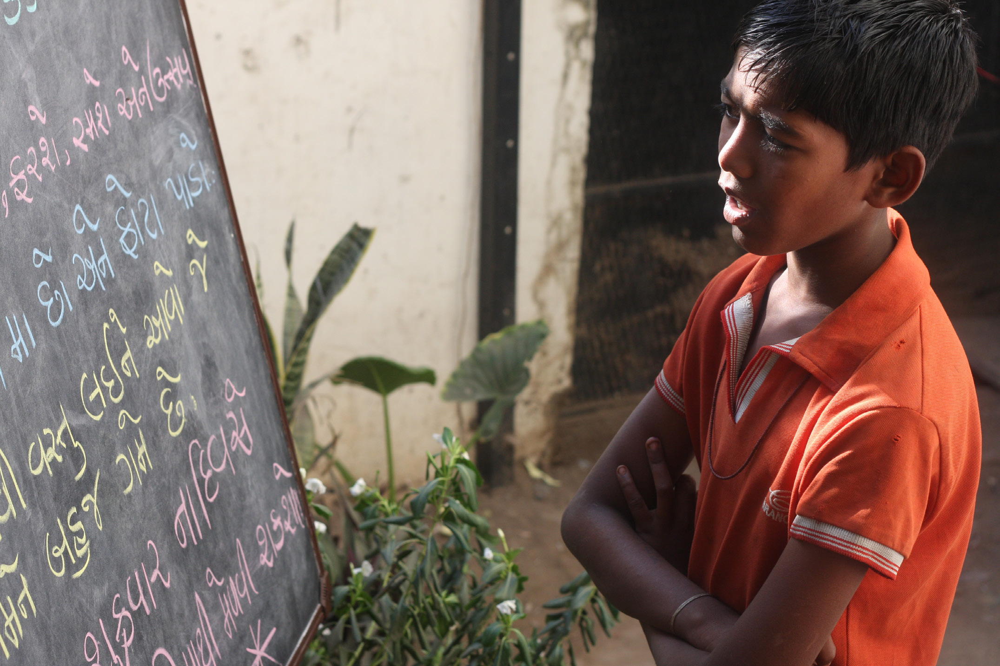

## Museums without walls
_Pete Collard_

I arrived in Ahmedabad with a very open mind on the caravan and how it might work. Having been associated with UnBox directly and indirectly over the past four years, I knew that coming with preconceived ideas or a pre-planned project would not result in productive collaborations. Instead, better to embrace the fluidity of the situation and let things work themselves out. Hopefully. Somehow. In particular, better to arrive, meet and listen to the other caravaners. UnBox is a chance to work with people from disciplines similar to my own or completely dissimilar (and when it’s the latter, so much the better for it).

As a non-designer (and most definitely a non-tech person), how things work is of less interest to me than in how they resonate with us emotionally. Much of my past work could be described as ‘traditional’, curating mostly static spaces with displays of objects, images, texts and films, although this has changed a little in recent years. Yet curating is a constant learning process and ultimately very rewarding. Of great personal interest is field research, going off the beaten track a little, to meet with new people and communities. And this is where UnBox excels, in facilitating such exchanges.

The fact that I had visited Ahmedabad previously was possibly useful, but also highly irrelevant; the city reveals new things to me each time I come. This particular visit will be remembered for the Conflictorium and the people, conversations and experiences that happened in and around it. The museum, if it can be given that title (or if it wants to be called as such), offers a telling demonstration on how to tell complex social and political stories in balanced and highly nuanced ways. It demonstrates also how such narratives can be told using alternative, nonlinear, methods of display that work across multiple linguistic and cultural barriers.

Most importantly, the Conflictorium reminds us there is never a single audience. Instead, like most communities, there exists a complex series of cultural, social, religious and economic circumstances that reflect on and impact our individual understanding of the same shared history. There is no one universal ‘truth’ to  be told, despite attempts by many established institutions to offer one. The dangers of communicating ideas in this way are self-evident.

But the Conflictorium also asks deeper questions about how exhibition spaces and museums can engage with local communities beyond the stories and objects they present. On Mirzapur Road, an outreach programme is run for local children that live and work on the streets around the museum, teaching English, drawing and performing songs (and allowing European visitors to pretend to be bears). These workshops became the inspiration for our project, exploring new methods of role-play and performance with the children, asking them what their future family might be and how Ahmedabad can change over the coming years. The results were chaotic but above all a lot of fun, which was to be entirely expected and definitely encouraged.

These kinds of ideas are potentially relevant to museums everywhere. As the traditional concept of a ‘museum’ becomes ever more fluid (and increasingly financially challenged) new frameworks and working practices need to be established that can strengthen existing audiences and nurture new ones. Performative and participatory engagement can help foster this process, creating new co-authored content, which in turn supports the idea of a real museum community, a community that can be an active stakeholder in the space. The histories that museums notionally hold have been created by the public, yet historically have felt disconnected and separate. Our future histories need to be more democratic, accessible and accountable.

Through the UnBox caravan I have been able to work and explore ideas such as these that take my practice in new directions, far outside my usual methods and approaches. Theatre and performance were previously akin to Hindi and Gujarati in my vocabulary, yet through working at the Conflictorium, I hope to further develop these ideas into future projects.