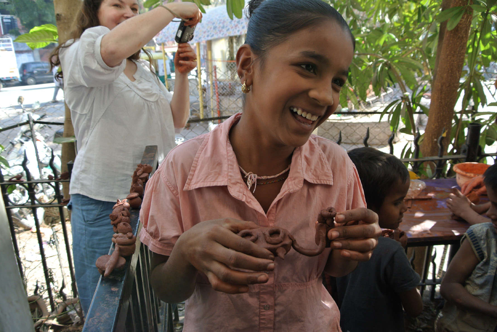
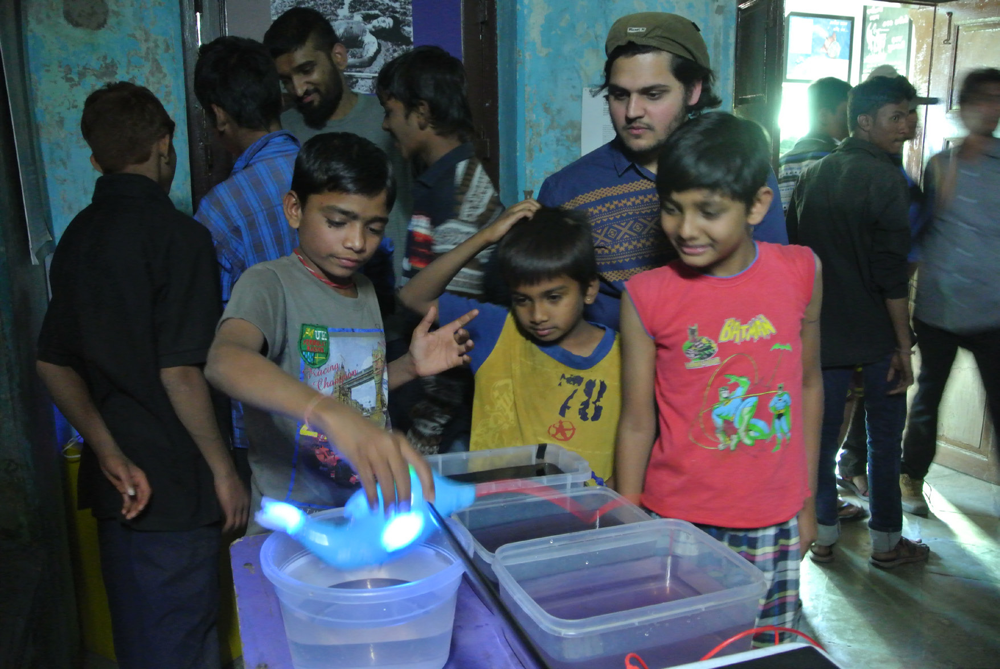

  
<a href="2_04.html">previous</a>

  
<a href="2_06.html">next</a>

  

---

## Camera things
_Sara Legg_

It is interesting how different environments of interpretation – the people, places and things that collide to make meaning – create for me an entirely new object, from an object I felt quite familiar with since childhood. The object I’m talking about is a disposable camera. It isn’t just that the ‘meaning’ of the camera that changes as I change environments, but the actual object that is a camera – it’s ‘thingness’– changes in relations to other things, if we take for granted that all things are in relation.

My team at Quicksand had ordered a box of ten disposable cameras at my insistence that we try to use them in an upcoming field research trip to South Sudan. Unfortunately the cameras arrived a few days after my team had departed, so I thought what better way to make use of these cameras than to take them to the UnBox Caravan.

My understanding of the disposable camera became complicated first when  going through security at the airport while on my way to Ahmedabad. The box with the cameras was removed from the security conveyor belt and a security staff member asked what was in it. When I told her it was a box of cameras she looked at me blankly, before opening the parcel to inspect it. She pulled one small cardboard rectangle out, looked at it in disbelief, and proceeded to open one individual camera. I repeated that it’s a camera while another curious security guard joined her. She didn’t believe me, claimed the box was much too small to have a camera inside, and unwrapped the protective foil around the disposable camera. I repeated that it was a camera, but it never registered. At no point does
she look at the camera with a nod or offer any other kind of acknowledgment that would suggest she knew what she was looking at.

And so the camera in all its thingness has bubbled up into something else. Is it the camera that changes for me or is it the security guard? Both? Is it insightful anymore to describe experiences as mediated? I’m now recalling Ian Hacking’s comment on the observation that something that is socially constructed is not very impressive.
During the second day of the caravan the participants were asked to come up with ideas to pursue and prototype for the remaining week and a half. I noticed a lot of them walking around the first couple of days snapping photos of shops and people, and especially children. As a facilitator wanting to instigate further exploration among groups, I suggested a common research method, cultural
probes. Cultural probes are essentially objects chosen participants interact with – and this interaction informs and illuminates a design question to varying degrees. For me, there wasn’t time to make thoughtful, skilful, even rigorous ‘cultural probes’, so I thought at least the cameras could be used as an ice-breaker or first point of research contact between the caravan participants and the residents of Ahmedabad they were engaging with. I wanted to give participants a research tool they might not have used before. Yes, scrappy probes they were indeed.

Jon Rogers thought it would be a good idea to call these “empathy” cameras. This came up in response to several negative reactions to the disposable cameras, and Jon attributed this to a feeling of uncomfortable violation denoted by the word “probe”. It’s true, there isn’t much nuance to “probe”. On the other hand, empathy has its limits, especially from behind a camera.

I had a box of ten disposable cameras, which I gave out to various caravan participants and NID students to experiment with in any way they saw fit. Below are three observations of how people chose to use the cameras.

**Jayne’s camera**

Jayne Wallace of the School of Design, Northumbria University was interested in the cultures of pottery making on the outskirts of Ahmedabad and spent a lot of her time with them along with her design partner Sean Kingsley, a technician at DJCAD, University of Dundee. Through the course of their conversations Jayne and Sean asked if the potters wanted to use the camera and they seemed happy to. Jayne and Sean directed them to take photographs to document their daily lives.

Jayne made further observations that all the kids were asking her to take their photos constantly. She found the camera as an object fascinating in India as the kids adored seeing their pictures. She tells me in the village, people had almost adopted a pose and didn’t smile. One woman in particular wanted to have a photograph of her and her family and really wanted to be able to zoom in on the photograph. There was  a big difference between a disposal camera and a digital camera that they were then able to see themselves in. I have personally found this to be a social norm in India – if you  have a digital camera and want to take photos of anyone, it is customary to turn the camera around and show the person the photo. The delayed gratification of the disposable camera was likely a bit bewildering.
Jayne tells me that there are loads of differences between a camera and a cultural probe. She reminds me that people have called anything a cultural probe, even a notebook, and
insists there is scaffolding involved in making design probes work.

**Bharat’s camera**

Bharat, a furniture design student, came up to me when I was presenting the disposable cameras to the caravan team as a possible empathy tool. He was curious about the possibilities for cameras to capture the daily lives of people, not so much for furniture design research, but as a purely exploratory measure.

Bharat gave his camera to a family with four children. He told me they were members of the Harijan community, which he described to me as a ‘sweeper’ community. A quick look online search reveals this is another word for the Dalit community, popularized by Gandhi, and is increasingly considered derogatory. The word Harijan was originally coined by a Gujarati poet-saint Narasimha Mehta, and we were after all in Gujarat – so maybe Bharat was attempting to reclaim this word.

The family Bharat chose does laundry work -- they wash and iron clothing, and one of the children goes to work as a nurse. Bharat picked them because they were approachable and he knew them, and he could see they were having problems.
He described their home to me -- they have only one big hall with a television, just a structure they made out of stacking stuff, and they sit outside on the front porch doing the ironing work all day for which they received a meagre amount. Apparently this family was quite acquainted with NID and its students as they are often approached research projects.

Interestingly, Bharat’s house help came to him and asked why he gave the camera to the family as she thought she would be getting it. She told Bharat the family came to her house and took her photo, and she was happy about that  and wanted to see the results. Bharat surmised that in this particular community having a camera changes a person, and everyone wants their picture taken, “when you give someone some task like this it makes them feel special - and this was a different ‘click camera’”. Here it seems the camera acts on a person, affording them another status, and in this case a special status owed to the uniqueness of a disposable camera.

**Annette’s camera**

Annette Mees, a director and artist based in the UK, brought two cameras to a group of children at the Conflictorium; a museum dedicated to showcasing art and culture to create
a dialogue about peace and conflict, located in the older part of Ahmedabad. Annette had been spending time with these children teaching them songs and theater, and wanted to spend one afternoon asking the children to take photos of their surroundings. A teacher read directions to the children on how to take photos of things that were inspiring, and things that posed trouble, with the intent of discovering what might be ripe for innovation.

It wasn’t a minute that we were outside before the children started beckoning the general community around the Conflictorium to take photos of and with them. Soon after everyone wanted a picture with Annette or myself - our clothing, skin colour, the new camera - all of it was very novel. It became apparent that we were a major distraction from the task at hand, so I suggested we go back inside and leave them to take photos of whatever they wanted. I’m not sure what happened after that. The enthusiasm died down, the children came back inside, and we had to wait to develop the film.

_What is interesting here is not so much what was on the film, but how the participants made choices about who they gave the cameras to, and how the cameras instigated interactions and created new relationships – relationships between the camera and the person using it, and relationships between people mediated by the camera. The camera is a thing that acts in society and in relationship to other people and things, its meaning and movement determined by the environment it finds itself in – at times a foreign object and at others signifying a special status._

---

  
<a href="2_04.html">previous</a>

  
<a href="2_06.html">next</a>

  

