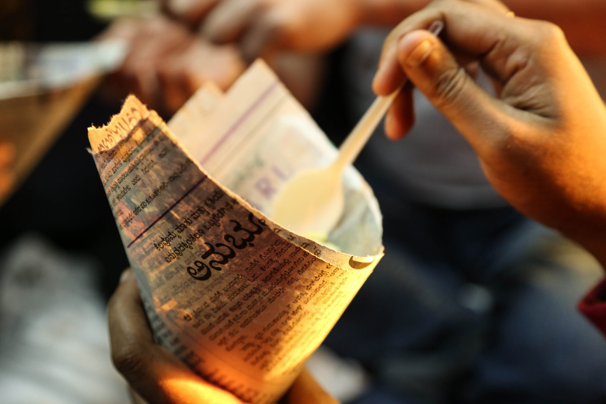
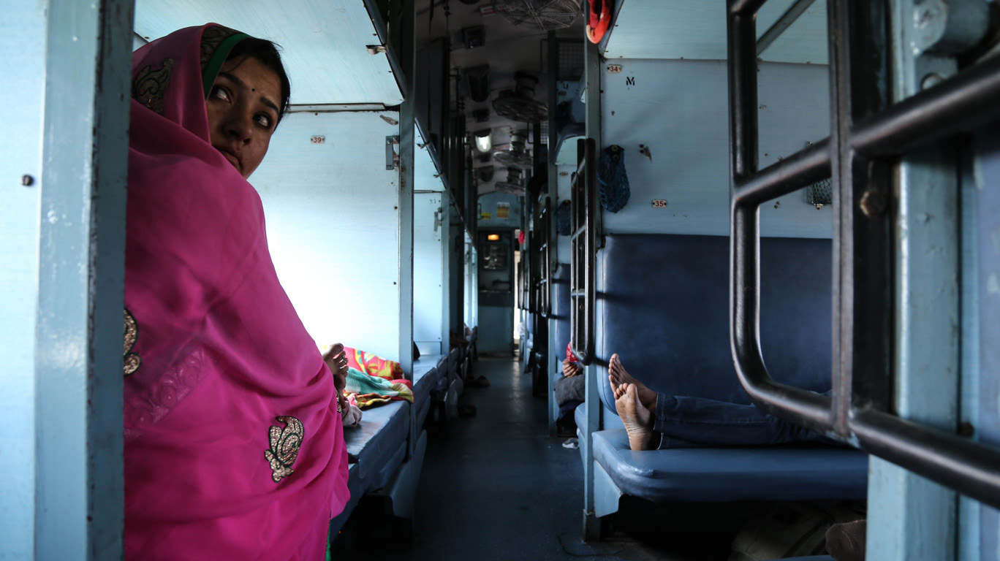
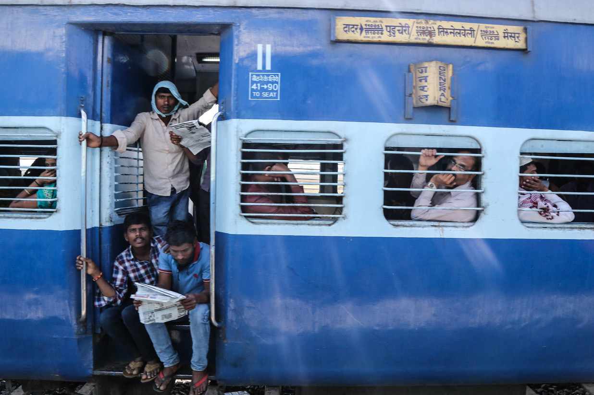
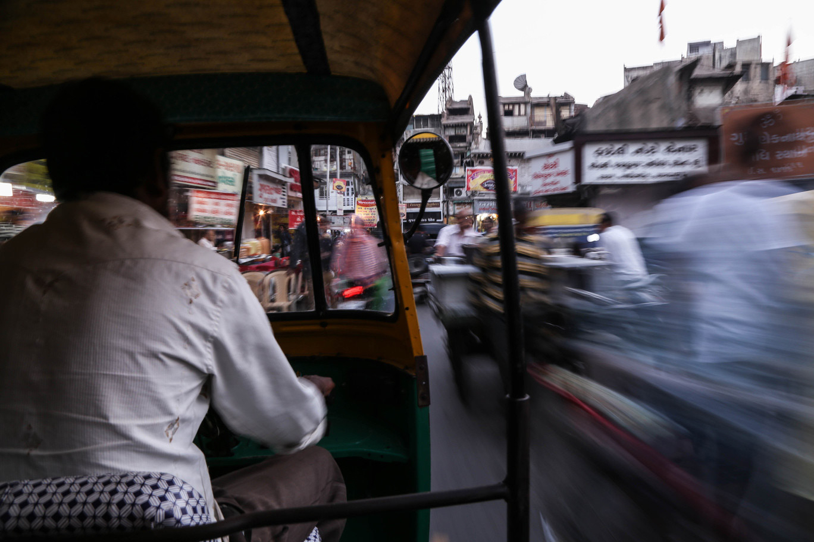
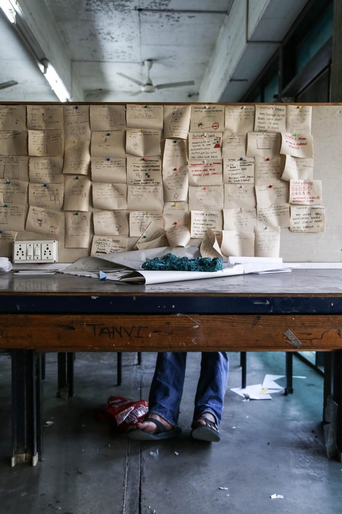

## Immersions
_Laura De Reynal_

Getting close to a group of users can happen in different ways, through different types of interactions, but it needs to happen to conduct meaningful design or ethnographic research. You can choose any method you want, but the most meaningful insights arise when you immerse yourself in the culture and the community that you are studying.

  _Like many of the long distance train rides across India, the journey from Bangalore to Ahmedabad is a concert of people selling local—often handheld—food._

**En route**

By train, it takes 38 hours to travel the 1600 km from Bangalore to Ahmedabad, with frequent stops for new passengers, food, and chai. Riders experience India’s vibrant railway ecosystem: a unique, physically narrow, and fascinatingly transient community of residence and commerce—continuously immersed in an atmosphere which many Indian people are familiar with.

  _Making their living environments as comfortable and possible for the long journey, people use their own space and their friends’ to eat, chat, relax, and sleep._

  _People  ow to and through common spaces, taking advantage of open doors and invitations to talk._

  _We arrived in Ahmedabad at NID inspired, with a localized appreciation for things that many young, aspiring Indian people feel: distance and community._

Working with students Another way to be immersed in the culture and atmosphere of the Caravan was to work directly with the group of students at NID. We spent lots of time working with different
groups, some more than others, to follow their progress and  help when possible. Mingling with different groups and participating in their diverse activities allowed us to be immersed in the culture in a more indirect, yet very useful, manner. A few interesting insights and lots of inspiration came out of this meaningful collaboration.

Sometimes, it was useful to share specific research skills and mindsets with the groups. In this picture, you can see Himani asking some families near the Conflictorium to tell  us more about the community and to share some stories from the families with us. This was designed to provide content for a storytelling IoT project  the students were building, to bring communities together. We spent a good time going around this neighborhood
and talking to people to understand it better. In the end, this made their project exhibited at the Conflictorium way more meaningful and real. The exhibition was made by the community and for the community. What can be more immersive than this?