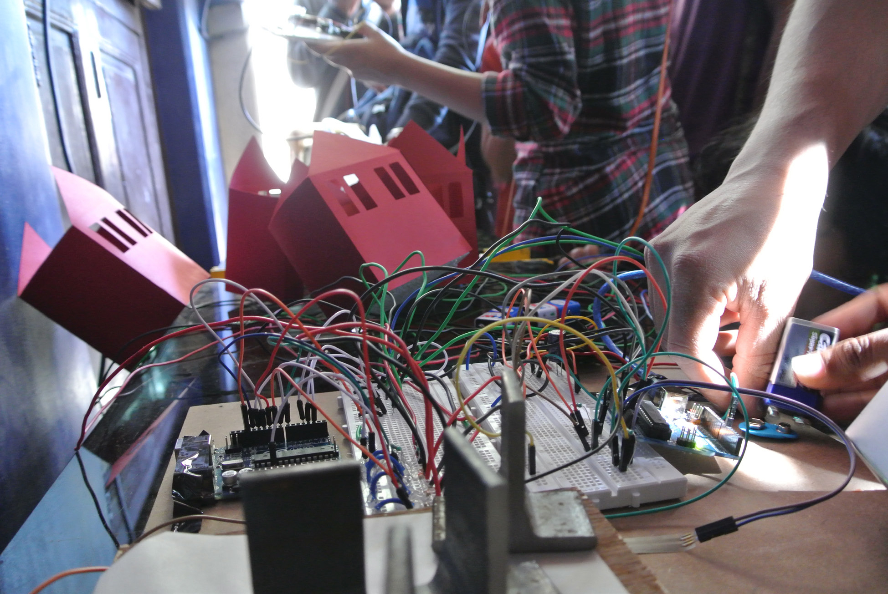

## Story of a caravan journey & chai-gate conversations
_Reuben Jacob_

I embarked on this journey with an open mind. That feeling when you just do not want to listen to what others have to say about how you do things, sums up my mental state before I landed in Ahmedabad.

With seven years of architectural design based tempering, my mind was in a state of excited restlessness, having been recently exposed to the wider spectrum of art and technology and the growing synergy between the two. The Connected Communities theme of the UnBox Caravan
was just that, I didn’t need convincing to accept the invite to ten days of collaboration and discussions with myriad individuals from various creative and technological walks of life.

Having recently become part of an organisation - Think Happy Everyday -	that constantly questions structured norms and patterns of creative workflows and design ideation, I had had my fair share of dabbling with Arduinos, LEDs and sensors in the installations that we set up in our six months of work. I was ready to make and do at the caravan.

The caravan, Ahmedabad and NID had a larger diabolical plan. On Day 1,  I was thrown into a chaotic, cultural hotpot of creativity and interesting people. Conversations seemed familiar and instant synergies formed. All my preconceived notions were scattered by the relaxed but vibrant vibe of the NID campus and friendly atmosphere created by my fellow caravaners.

Meeting the students and becoming a part of their studio was truly insightful and gave me a moment or rather a few days to pause and look back at a time when I wasn’t forced to carefully articulate and structure my work based on factors and parameters that the system or clients imposed on you. Some of the projects had a great sense of sensitive societal intervention in using familiar and recognizable constructs of daily life to bring technology to less exposed sections of society. Visiting the smaller maker communities in and around Ahmedabad was  a different experience, showing us that creativity and innovations exists even in the most crowded and least connected parts of societies in India.

**Chai gate charcha**

The caravan conversations were probably the most fun and also the  most mentally invigorating parts of the whole experience, most of which took place at the Chai gate. I didn’t need an excuse to go for a smoke and a chai and most of the time I would end up sipping cold chai as I would have ignored it, fully engrossed in conversations about Internet securities, musical influences, dark temples, brown temples, grey temples and ghantas (bells).

**Bells and dark temples**

It was journey that made me stop, look through a kaleidoscope of creativity, technology and culture. I was actively involved in two caravan projects that were polar opposites in philosophy. The Ghanta Project looked at placing IoT connected Ghantas bells in homes and clustered communities so that they could use it as a call beacon to gather as a whole, physically and even virtually, to share and celebrate as a community.

On the opposite end of the spectrum, probably even penetrating the dark side of the interwebs, was the Dark Temple- an order that chooses to isolate or enshroud themselves from the realm of cyber signals and electronic frequencies.

**Taking the caravan to the community**

The exhibition at the Conflictorium of the final manifestations of the various projects by the caravaners and students was one of the most unique and energetic exhibitions I have
been to, with flocks of children and people from the local communities thronging the various displays of IoT based fare.

The caravan served its purpose for me, as a journey of taking a pause and re-aligning myself to input more local and cultural influences into my work for the future. Here is to taking forward all those conversations from the Chai Gate and one day possibly seeing a world with Ghantas and Dark Temples!