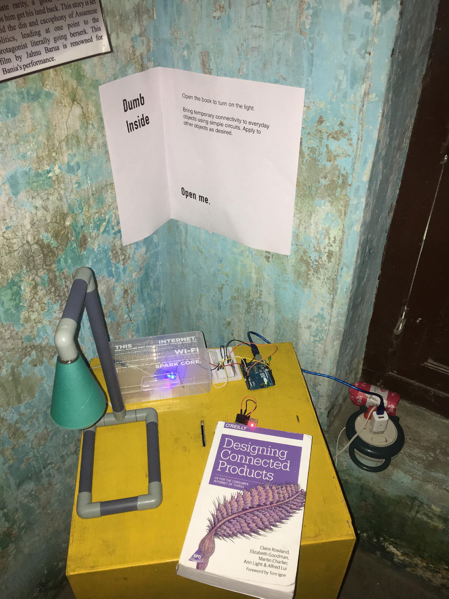

  
<a href="3_01.html">previous</a>

  
<a href="3_03.html">next</a>

  

## Journal entries
_Sean Kingsley_

**1 February 2016**

Blimey! India is an assault on all the senses. I am not sure how to take it all in, within the next couple of weeks, but I have to. There is no escaping it unless I just sit in this room and go out for meals to the canteen occasionally. But what is the fun in that…?

**10 February 2016**

Today we needed to go and collect the camera we had left as a ‘cultural probe’ in the pottery village Sarkhej, south west of Ahmedabad. We got Christopher the auto driver again. I have had him a few times and probably only remember his name because it seems somewhat unusual.

Irini hadn’t been to the village, so we did much of the same touring around we had done before. First stop was  the second pottery shop we came to on that first day, the one with the thrower. Today he was working, rather than him having to ‘demonstrate’ to us during his rest time. There was another potter there, throwing a small round of desert pots. During a pause in his throwing I took out my camera and showed pictures of the work I do, which includes pots, the clay pit, the potters wheel that I work on, and an example of my daughter’s drawing on a plate. I have done this before and it is becoming established as a great way to share with people who I am, especially when neither of us can speak the same language. It appears to aid a mutual understanding, so it becomes a two way thing rather than me just observing. It appears to work in non- pottery environments too - I showed the same photos to a large Muslim family who had requested photos of us at the Sarkhej Roza mosque and tomb complex. They were interested in us and I wanted to share something with them.

The potter showed me the kiln again, describing the height of the pile of pot in the kiln and how all this is covered with big pot shards. It takes three hours to fire and nine to cool down (though with the lack of mutual language, I am not entirely sure this case).

Jayne encouraged me to ask to have a go on his potter’s wheel. This is something I might find quite irritating myself (hence my reluctance), but he was fine about it. He uses an unusual technique in making cups. He pushes out a flat disc first then lifts the edges up and manages to narrow it again. At least I think that is what was happening
–	it was very  quick.  I  wasn’t able to duplicate that method. _The local family came to see how I was doing. I could tell from the potter he hadn’t expected me to be able to do anything, so there were little sounds of surprise from all watching when I managed to produce three pots similar to the cup he was making, using my method. The potter even picked up one of my pots to show his wife when she came out to see what all this was about._

Next we went to the workshops where we had given a camera. As we waited for the camera to come from their home, I asked for a go on the stamping machine used to make diyas. This wasn’t quite as physical as it looked, since it is very nicely balanced. Last time we visited we took some clay from them and when refusing payment they had asked to see UK coins, so this time we gave them two sets.

Walking around the corner was another thrower. We stood outside his property and looked at various unglazed salt pigs, lamps and dishes until a rather fed up looking potter came out. On the three occasions we have visited the village, we have always arrived too late, since the workers were usually resting then, having started their work at 4 AM. I don’t  blame him for looking fed up. After some short discussions regarding prices, I got out my camera and showed him my  pot pictures. He transformed into a laughing, smiling potter and invited us to his property and workshop. He started off with a ‘hump’ of clay on his wheel and proceeded to demonstrate 12 different pots (including an ironic, I think, cup and saucer) in 14 minutes. Good, rough and freely made stuff. We bought some things from him.

On the way back to the auto, we met an angry looking cow and a fellow who was very insistent on taking us in to his house. (They weren’t together). Inside was a great sleeping lump, which he just ignored as he set out chairs and laid down on one of the bed cots. Then his mother came in. She looked really old. Jayne and Irini were lovely with her – no English and just a wee smattering from her son. The three ladies pointed to jewellery and compared. Another great way of connecting. The mother, however, seemed to be disappointed with Irini for having so little jewellery. For all the untidiness and rubbish outside, nearly all Indians are amazingly, beautifully well dressed and extremely clean. It is a curious contrast. This lady was obviously looking after how she looked. However the lump on the floor didn’t seem to particularly care. After a bit of farting and bum showing, he arose all cock eyed and stumbled to the outdoor loo. Poor guy.

In the meantime the house owner had asked me if we wanted a soft drink. Of course I refused, but he insisted in that way that makes it difficult to refuse without seeming rude. So I said Sprite expecting him to get it from inside the house, but he jumped on his bike and off we went! Five minutes later we had it and the Sprite was delicious, as it was actually pretty hot.

_(A little detail: he brought three plastic cups too – he may well have been aware that we might have had some reluctance to drinking from his cups.)_

The original potter turned up just as we were preparing to leave this house – our host had been a quite insistent guy – we were invited to go to his. Already we had been in the village for over two hours. Before that though, the potter took our host out and showed him the pots I had made. He came back and exclaimed ‘You a full potter man!’. High praise.

On leaving the house our host said how happy we had made him in visiting his home. He gave Jayne some diyas and Jayne had insisted on paying for them, having seen a wee message from the mother, who had rubbed her fingers together as  we were getting up to go. The man refused money, but the mother happily accepted it.

It turns out the potter wanted to show me the house, which was still being built. This was interesting because I could see the layout without any privacy issues, as it was just a shell. It was simply the three connected rooms, with the end room having a high shelf around the top. There may have been access to roof space – I’m not sure.

Between these two homeowners, they explained to me that the father had died three years ago, while the original host’s father had died 16 years ago. I think they were suggesting  that there is some sort of inheritance that they both received with the more recent death, explaining why this house was only getting built now, while the death 16 years ago explains why the other house was finished and inhabited.

Each time we visited this place we were getting pulled into the community more – or so it felt. We were making connections with people, who could see we had shared interests with them and an enjoyment of their place. An amazing experience.

---

  
<a href="3_01.html">previous</a>

  
<a href="3_03.html">next</a>

  

