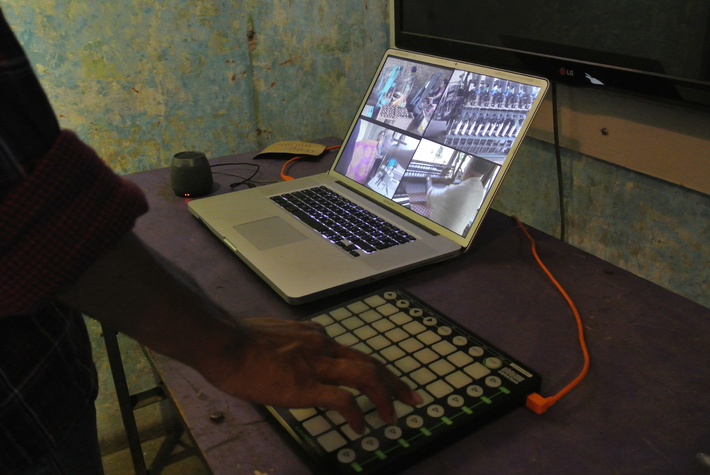

## Unbox redux
_Gary Stewart_

Through the two weeks of the Caravan, one of the things that stood out to me is the relationship between students from NID and artisans in the city (of handwoven textiles and materials, manufactured ceramics and metal goods). These highly skilled workers proudly participate in extending the student ’idea space’ not just by actualising the prototypes the students have imagined; it is a virtuous circle of communal symbiosis and socialising. The students are not considering how to supersede and replace but are carefully reflecting on ethical design approaches that preserve traditional and local sustainable manufacturing.
Out on the field trips, it was amazing to see an enclave of metal-workers and fabricators, who willingly with great synergy compliment each others activities; eager and  happy to recommend and approve other suppliers where appropriate, in a balanced system of mutually beneficial support that serves the system operating as a whole.  Some of the products are distinctive and uniquely hand made in relatively small quantities while others are one off and specifically a very particular part of a greater whole reproduced at great volume. It’s a harmonious balance emerging from a human spirit of co-existence, not enforced or regulated by some draconian punitive force. This is real alchemy, the transformation of raw material through the harmonious sequence and correlation of different elements.

So what do we make? The caravan encourages a different approach and process. A shift from something envisaged beforehand and placed before the viewer to something that was inspired and born from a process of reciprocal creative labour, communication, sharing and reflection. Placing yourself with others at the intersection of co-creation and participatory interaction without the counter intuitive imperative or necessity to ‘create and make’ as rapidly as possible can often yield surprising outcomes.

From this process and inspired by the documentation  from other caravan participants I start to think about the structure of a playful sound and visual environment where the rhythms of work are accentuated by the regular repeated patterns of movement and sound. Harmony, dissonance and counterpoint emerging from the duration and periodic tempo of individuals and groups of humans and machines locked in mechanical processes that articulate a sequence of events, dynamics and processes into new compositions born out of the imagination and labour of women, men and machines.

_What new meaning might emerge from the unexpected sonic song of the brass stamped metalwork playing with a printing block maker? What kind of kinetic choreography might happen when a diligent scissor maker is now playing with the frenetic widget maker?_

I built UnBox Redux as an environment where activities that normally inhabit different worlds can be celebrated together with each other; a playful invitation to the ‘performer’ to
create abstract connections between different forms of making. The user has to conduct and curate the narrative and in doing so are intimately embedded and mixing the content with no fixed structure in advance. It is meant to be open, inviting and fun and if in the midst of all this, some particular serendipity takes place or profound abstraction emerges that would be great too! And in that sense, it is a mirror of the underlying spirit and ethos of the caravan itself.