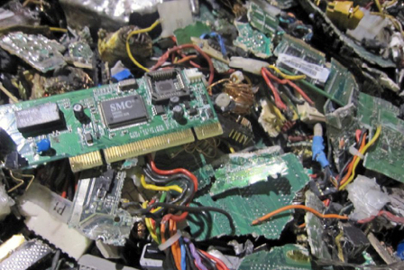

## Digital India
_Jon Rogers_

OK. Spoiler alert. This text contains a pretty big Jon Grenade – this time against the use of ‘Maker’.

Let me start with saying:

    I LOVE PEOPLE WHO MAKE THINGS
    I LOVE PEOPLE WHO CARE ABOUT MAKING THINGS
    I LOVE HAVING THINGS MADE FOR ME
    I LOVE BUYING THINGS FROM PEOPLE WHO HAVE MADE THINGS MAKING THINGS SAYS LOVE LIKE NOTHING ELSE
    FULL STOP
    END OF MESSAGE

I do not call myself a maker. Yes, I build and craft behaviours in electronics and code that cross between physical and digital. While I make lots of food – you’ll know that if you know me – I don’t call myself a maker. It would sound pretty pretentious – a bit hipster – a bit, well, wanky, to say that the things I make at home make me a maker. In the same way as baking bread doesn’t make me a baker. That wiring up a plug doesn’t make me an electrician. ‘Oh Jon’, I can hear you say, ‘you’re not getting it’. The point of the Maker Movement is to be inclusive, to bring people of all skill levels into a level playing field and promote the very good thing that making is, which I completely sign up to. So why am I in this moment of crisis? Why is ‘Making’ making me so frustrated?

I think it’s about quality.

_Being in India, seeing the things that are crafted by people who have honed their craft over generations is making me feel a bit embarrassed about the triviality of the maker movement. That villages of people dedicated to making things to provide food for their children is a very different thing from popping into a Maker Space to tinker, play and tell people you’re a ‘maker’._

I’m frequently seeing computer science conferences calling for themes of ‘making’, in an attempt to try and add value to a discipline that has been losing its way for some time, and in a space where people are ‘users’ and human computer interaction is a human way to describe how people interact with computers.

What’s exciting about India is to find a space between the craft of making physical things and the craft of coding digital/physical experiences. If we can bring the incredible cultural value of the crafts people of India and the craft way of thinking into the immense economic value for those that can write code, then we will be future proofing a digital movement that I for one would create a profile for and sign in to. That it could provide the leap in development that is never going to come from Silicon Valley and open up a new creative digital economy that could challenge that dominance of the employers of the 90,000 people from India that the Valley employs. That a digital India would embrace all of our senses – could be messy (tick), will be crowd based (tick), will be constantly re-invented (tick) and could provide a level of quality and trust that digital surely needs right now. Now what do you make of that?

The western world landfills millions of tons of electrical waste every year. This is a disaster in terms of sunk costs in replacement, embedded energy in their production and the looming spectre of megatons of non-biodegradable materials sitting in landfills.

Makerspaces have the tools and their users have the skills to repair electronics  that may only be a short step away from being fully functional – what challenges could be framed that would treat the repair of an appliance as a geek gauntlet thrown down? How about a cost of entry to a makerspace that demands a number of successful repairs to unlock the resources for your own project? A badging system that gamifies your repair skills, maybe based on points accrued for number of items multiplied and agreed difficulty rating? Bonus points for novel use of technology and tools to effect a repair, or for documenting the repair for others to learn from? Did you need to 3D print a spare part to get that washing machine working again? Release the .stl and get extra points and kudos. It is also important to be aware of challenges including intellectual property of 3D printed spare parts, electrical safety ratings, clarity of ownership of the repaired object, and most importantly setting expectations.