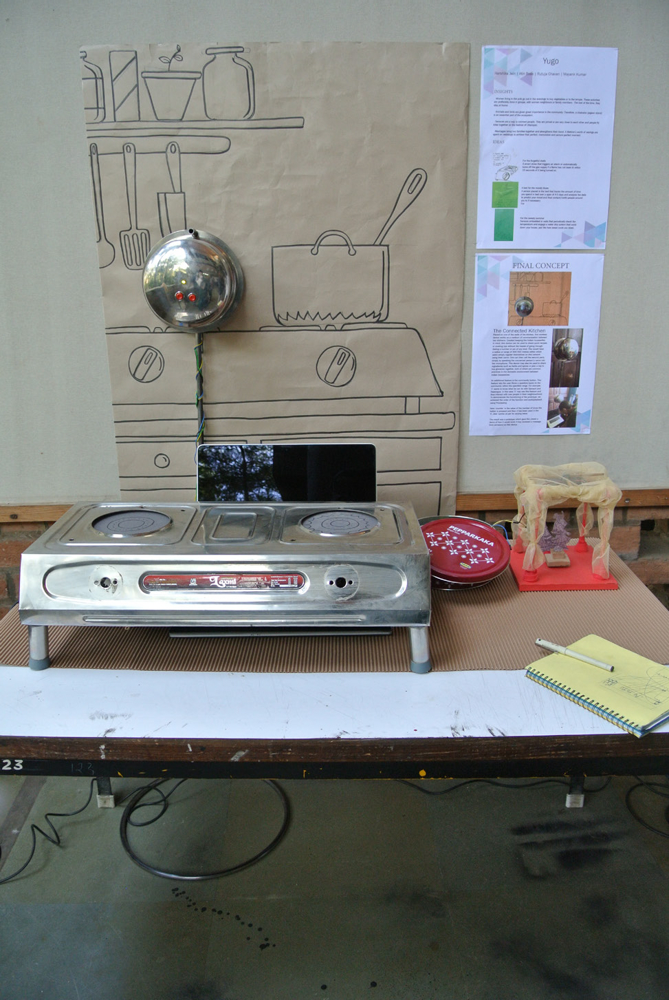

## The jugaad of code
_Bobby Richter_

Right now, I’m at NID in Ahmedabad, India. Walls and closed windows are sparse, letting the noise of the city pour into workspaces. The city feels alive, and it’s full of makers, fixers, cooks, and entrepreneurs. Here, the way I write, and learn to write code feels very natural. It’s part of the process that I’ve been trying to instill in students since I started to help them with their own projects during the caravan. However, there was already a great colloquialism that described this problem solving method in one word: Jugaad. Asking someone to explain the concept is difficult and interesting, but it’s obvious when you get to see it or use it to build or learn something.

At some point, learning any new piece of technology has to extend beyond the Wiki/manual etc. In fact, when I learn a new programming language, there’s a certain magic phase somewhere near the beginning where I know very little about what’s really going on, but I know enough to force pieces together until they do generally what I need: somewhere between running the interpreter/compiler and writing a tiny game. Then comes hours of teasing it apart, learning more about how each piece actually works.

But, those first “Ah-hah!” moments are so gratifying: they are what inspire you to forge on and see what else you can do. They are also the reference frame for building things. Most of my first projects/experiments are new pieces of scaffolding stacked on top of old pieces of scaffolding. And every once in awhile, when I figure out a new trick, I iterate on things I’ve already done to make them better, smaller, and faster. I can’t think of a better way to learn something.

The problem-solving environment that a text editor and a debugger provide is special: it lets you constantly make safe mistakes, and learn from them instantly (provided that you find the semicolon that you were missing). And when you have that sort of setup somewhere in life, it’s an incredible experience (like having Mr. Miyagi at your side). There are lots of safe learning situations in which you can learn to, say, use a baseball bat, drive a car (in a parking lot, at least), or take pictures with a DSLR. In fact, I would say this whole Unbox caravan is run with a sense of Jugaad; people are being inventive and producing solutions, making the best out of the benefits and affordances of the places and the events in which the group is immersed.

In computing, however, decades of work have been devoted to making just this problem of delay comparatively miniscule. So, when you’re used to that response— that freedom—being around students who don’t yet have an appreciation for it, is sort of thrilling. You can just say, “well, just comment that bit out, and try it.” Or, “hmm, there are 8 values we could use here. Let’s just try them all.” Not only does it give you a response from the machine that feels more intimate than reading a [poorly-written/ incomplete/ boring] Wiki article, but it teaches you a little bit more about how machines work, how flexible they can be, and how they’ll do exactly what you tell them to do (most of the time) whether or not your logic really accomplishes what you think it should. As a programmer, I can rely on those decades of iteration on machine systems, to isolate potential problems to bugs
in code that I’ve probably introduced myself, and I can work on removing those problems without a lot of interference from the machine or environment itself.

But, this week, Jugaad was a real asset when dealing with hardware: resistors- pulled-out-of-plastic-bag-and-shoved-into-a-breadboard-and-squeezed-between- the-wires-of-an-LED-and-a-button kind of hardware. Students were tasked to use Arduinos (several, if necessary) to demonstrate some interesting ideas related to the Internet of Things, which translates to humans rubbing up against machines in ways in which I’d expect only experienced manufacturers to feel comfortable. Consequently, we learned lessons immediately about noisy inputs, faulty components, unexpectedly disconnected wires, and more. _Everyone—especially me— was taught or reminded about how undependable machines are without those layers of precision and redundancy. Like a slap in a face that says, “think analog!”_

The result was a great depiction of Jugaad: problem-solving, piece by piece, until we cobbled together the results we needed in a very convincing fashion. Our code fits the description well: patchwork and little hacks to make sense of hardware quirks, timing, and interfacing with other machines. Most importantly, everything works! It works super well. Of course, nobody should ever launch a satellite into orbit with this approach. (Please use rigor and redundant checks, hundreds of careful peer reviews, etc..etc.) But, at least with machines, when you’re trying to demonstrate an idea or have limited (or interesting) resources, you don’t need speed or perfection. You just need to solve the small, disconnected problems and make a whole project come together.