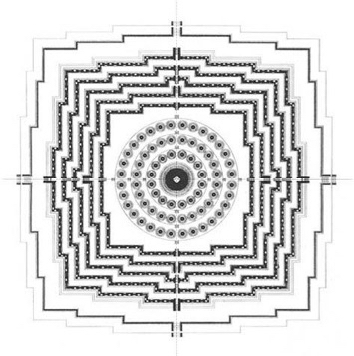
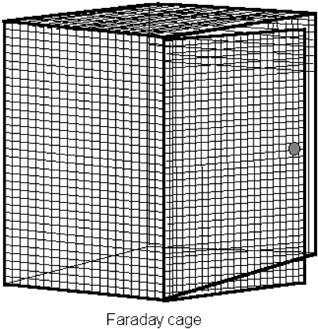

  
<a href="4_04.html">previous</a>

  
<a href="5_01.html">next</a>

  

---

## Code of the dark temple
_Vladan Joler_

The story of the Dark Temple begins at a really small city square ( 23°01’07.9” N 72°35’30.2”E) in the heart of the old city of Ahmedabad. This square is hidden in the labyrinth of hundreds of small streets and squares and it is a common space for the small neighbourhood community. In the middle of the square there is a small Jain temple, an architectural structure created for religious rituals and activities of small neighbourhood community, practicing an ancient Indian religion that prescribes the path of Ahimsa (nonviolence) towards all living beings.

After few days of observing this unique place I was intrigued with the question: In the world of Internet of Things, electronic communication and artificial sensors what will take a place and extend the idea of temple? What can be the temple in context of Internet of Things?

Exploring this idea became an adventure. Social, philosophical and technological investigation that created numerous exciting discussions within our group and with amazing local experts coming from the field of architecture, design and philosophy and religion. Ideas emerged from  this adventure formed The Code of the Dark Temple, a set of concepts associated with creation of the immaterial
and meta-architectural structures in the realm of electromagnetic spectrum that can be potential Temple for the era of the Internet of Things.

Dark Temple is a Void in the spectrum, an absence of signal, sphere of not-self in the ocean of electromagnetic waves.

In the age of electronic communication, wireless transmissions, mass surveillance and total transparency of the Individual, the Dark Temple represents a non-place, an emptiness in which one can be alone with their inner self or with others without interference from the world of
electronic communication, artificial sensors and the world of Immaterial Work.   It is a non-place which one neither adds anything to nor takes anything away from. It is a black hole that does not allow wireless data and meta-data to escape, and therefore cannot be directly observed.

  _Diagramatic references for creating a Dark temple_

**Architecture Of the dark temple**.  
A Dark Temple is a meta-architectural structure mostly existing in the realm of electromagnetic spectrum.  
There are natural and artificial Dark Temples. Natural temples are a scarcity, disappearing existence of places without signals. The one who wants to conquer all frontiers and control the waves will tend to transform all the natural Dark Temples into the network and exploit, privatise and control the resources of the electromagnetic void.

An artificial Dark Temple is the void in the electromagnetic waves usually artificially created with a use of different techniques, technology and structures performed or built by monks of the Dark Temple.

An artificial Dark Temple has the shape of a sphere. This sphere is filled with an electromagnetic signal that creates noise and by that transforms the inside of the sphere into a field of invisibility and emptiness. The inside of the sphere is fullness and emptiness at the same time. It can
be understood as a Dark Temple or a White Temple simultaneously. The Temple can be ephemeral or eternal. It is omnipresent. It can be small  or large. The membrane, border or walls of the Dark Temple are fields of disturbance.

Anyone entering the Dark Temple eventually leaves a trace, a signal of lost connection with the network. The sum of those signals can trace the shape of The Dark Temple. This is how the one who controls will have a power over the realm of waves and the network can see the existence
of the Dark Temple within its domain. Similar to the theory of the event horizon surrounding a black hole, the all-watching eye of the one who controls the waves can observe events on the horizon, the border of the Dark Temple but nothing behind it.

**Order Of the dark temple**  
The Order of the Dark Temple is not an order. It does not have a specific structure but has a set of fuzzy ethical principles that can evolve, be modified or disappear. The order consists of all beings (human, non- human, transhuman or posthuman ) that create or enjoy electromagnetic voids.

**Dark temple dynamics**   
Even the Dark temple is a void, and there can be just one void - there can be many Dark temples. The Dark Temple can move, appear or disappear and merge with other Dark Temples. Dark Temples are nodes of the abstract network, The Internet of Nothing, that is the sum of all nodes existing in the present moment.

  _Diagramatic references for creating a Dark temple_

**Ethics of the order of the dark temple**   
Electronic nonviolence is the fundamental principle forming the cornerstone of the ethics and doctrine of the Order of the Dark Temple. Electromagnetic void, the substance of the Dark Temple should not be imposed on others without their consent. A Dark Temple is not about jamming others,  it is about creating a void for the purpose of enjoying personal freedoms and gaining a silence in the world of noise. The choice to step out from the world of noise into the Dark Temple should be the choice of the individual.

The Dark Temple is neither a manifestation of technophobia or neo- Luddism philosophy nor an advocate for complete absence of digital communication. The Dark Temple Order advocates for balance and the possibility that one should be able to isolate him/herself and should have a right to create electromagnetic voids.

The Order of the Dark Temple practices different forms of Digital Veganism outside of the Temples according to individual needs and choices.

**Code of the dark temple and its existence**   
Code of the Dark Temple can be changed, modified or distributed by anyone. The Code does not belong to anyone but belongs to everyone. There is no one Code, there can be many in different forms and substance.

**Legality of dark temple or right to be disconnected**   
In the realm of the State, electromagnetic spectrum is highly regulated and owned by governments or private entities. Creation of void, disturbance or interference in electromagnetic spectrum is considered illegal in most of the countries. This is against the values of the Dark Temple Order which believes that anyone should have the right to be disconnected and to create a void in a nonviolent way.

**How to create a dark temple**   
There is no one way to create a Dark Temple, there are many. One should seek the open knowledge of the Do-It-Yourself in the fields of signal jamming, electromagnetic interference or Faraday cage.

---

  
<a href="4_04.html">previous</a>

  
<a href="5_01.html">next</a>

  

