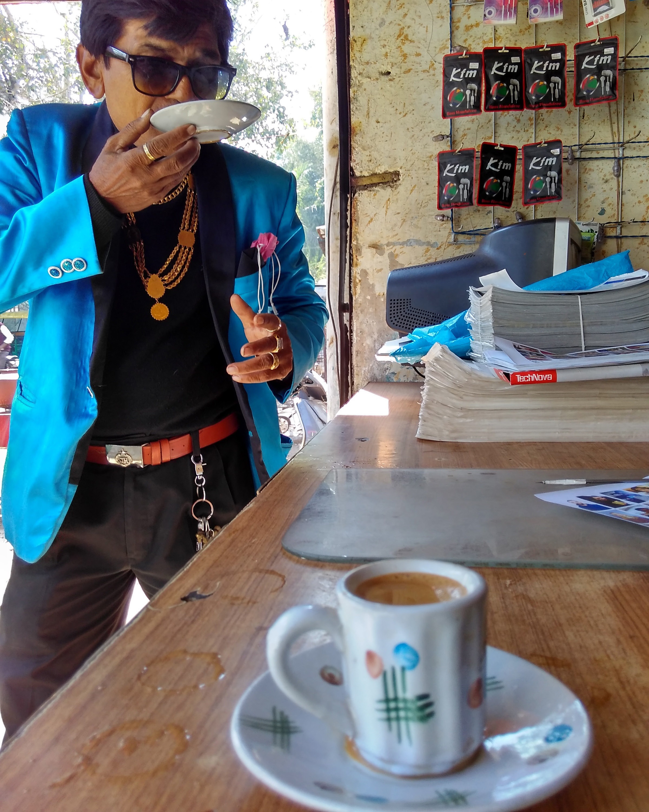

## What is the chai gate?

_Is the Chai Gate a geographic destination? No, it’s more a state of mind, a place in the flux of day-to-day living giving one a chance to pause, reflect, cogitate or simply muse. The route to such an altered state of contemplation is found within the volume of a small, whimsical plastic cup. Its contents burn with the fires of curiosity, testing the bonds of the very molecules of the flimsy container, daring it to release the tea in a plasma gush. It’s the constant reminder of this state of inflammatory peril, this fourth state of matter that reminds one of the fragility of life, or in Nietzsche’s words “To live is to suffer, to survive is to find some meaning in the suffering.”

_When one fully commits to enter the Chai Gate and accepts upon oneself the burden of the Minimum Effective Dose of the fiery infusion, one truly finds the path to a higher level of understanding the  loops, whorls and spirals of design thinking. The requisite pause in the turmoil of the day serving to soothe the creative furnace and rub spiced balm into the tired dendrites of right-brained thinkers.

_The nature of the chai gate as a portal defines it’s nether-like status; neither material nor immaterial, a gap in between the dimensions of within and without -- a Styx of sorts, offering the traveller a moment to define the gestalt of their day.

>To truly understand the chai gate one must, in every sense, become the chai gate.  
> — Adrian Cockle

>Our Fate: The Chai Gate   
> Dear Chai Gate,Through you, I find creativity. Through you, I find love. From you, I taste delicious things. But you are not delicious. You are metal.  
> —	Anonymous

> Chai flows through the bars. Friends and security guards. Don’t spill on the ground.  
> —	Anonymous

> The Chai Gate brings back nuances of passionate conversations, heated debates and acrid smells of Ahmedabad’s dust, traffic, cigarettes and human sweat. The Chai Gate is a meditation on the juxtaposition of daily street life, high philosophies and design thinking. It is the physical representation of the permeable, sometimes invisible lines between, privilege, circumstance, poverty, progressive thinking, wealth, conservatism, bureaucracy, buoyancy, cultures and countries. It is that conflicted desire to enter, mix, exit and stay of this milieu of people, animals, and dust, delightfully trapped together in a time warp.  
> —	Archana Prasad

> Chai Gate is the entrance to chaos, brightness, heat, colour, fumes, horns, cows, Christopher the auto driver and wonder. Wonder in the sense of “I’m wondering what I am doing on this side of the chai gate”. It is the entrance to respite, calm, cool, green and birds.  
> —	Sean Kingsley

> A chai gate is a mythical portal to a caravansarai. If you dial up the right symbols on the chai gate a portal opens that you can walk into and arrive at another point of time in another place. To change discipline. To change direction. To change yourself. Lalu is the keeper of the NID Chaigate – through him all knowledge is accessed, remixed and served up – hot, never cold.  
> —	Jon Rogers

> The caravan conversations were probably the most fun and also the most mentally invigorating parts   of the whole experience, most of which took place  at the Chai Gate. I didn’t need an excuse to go for a smoke and a chai, and most of the time I would end up sipping cold chai as I would have ignored it, fully engrossed in conversations about Internet securities, musical influences, dark temples, brown temples, grey temples and ghantas (bells).  
> —	Reuben Jacob